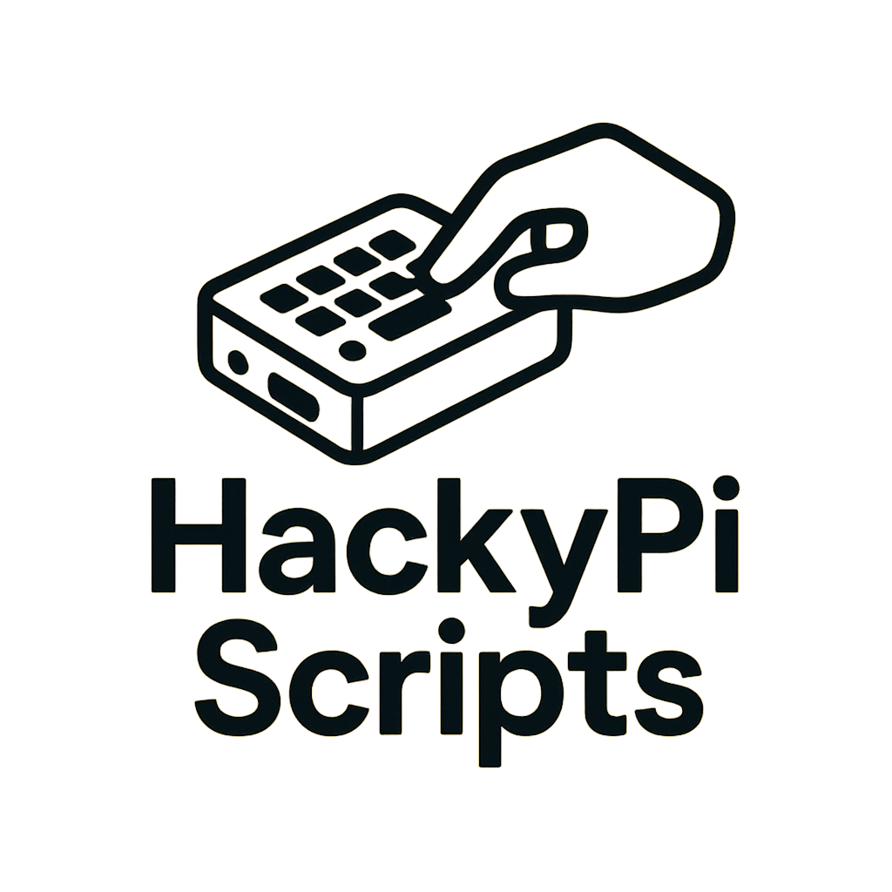

<h1 align="center">
  <br>
  <a href="https://github.com/OlsonTyler0/HackyPi-Scripts"></a>
  <br>
  HackyPi Scripts
  <br>
</h1>

<h4 align="center">A Collection of scripts for use with the HackyPi device, Python scripts created for testing purposes.</h4>

## Avalible Scripts

- Dedsecgif.py
> This is a program for writing a gif with display IO to the display

- structgif.py 
> Currently broken program using struct to write directly to the display

## How To Use

All you have to do for these scripts is install them onto your HackyPi by adding them to the devices storage. you will need to rename the script you are wanting to use as [code.py] That will activate the script the next time the device is plugged in.

```bash
git clone https://github.com/OlsonTyler0/HackyPi-Scripts

cd HackyPi-Scripts

mv ./<script name>.py ./code.py
```

> **Note**
> This repository was made very early on in my coding knowledge and likely lacks key features expected. improvements are welcome! 

## Credits

This repository was based on the work of the company's repositories. please see: 

- [HackyPi-Hardware Repository](https://github.com/sbcshop/HackyPi-Hardware/tree/main)
- [HackyPi-Software Repository](https://github.com/sbcshop/HackyPi-Software)
- [SBCShop Profile](https://github.com/sbcshop)


## License

MIT

---

> [olsontyler.com](https://www.olsontyler.com) &nbsp;&middot;&nbsp;
> GitHub [@olsontyler0](https://github.com/olsontyler0) &nbsp;&middot;&nbsp;


